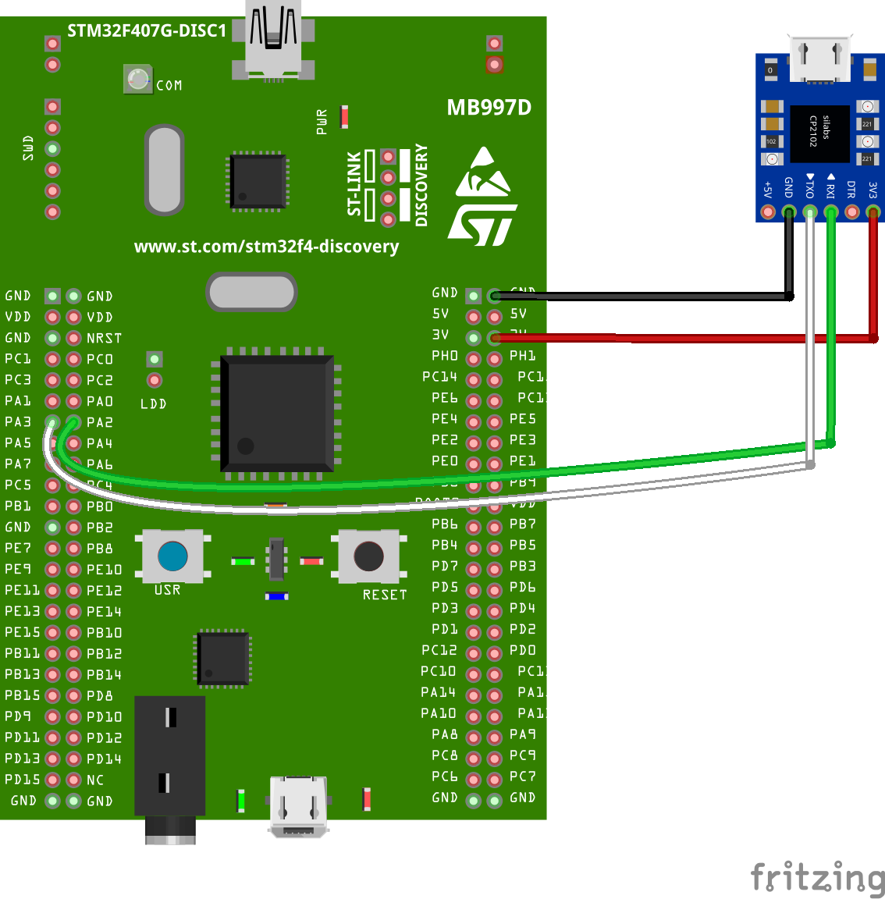

# STM32 UART RING BUFFER

## STEPS NEED TO BE FOLLOWED:-

**1. Put the following statements in the interrupt.c file**
```c++

//* We must add those *//
extern UART_HandleTypeDef huart2;              	 	//-> This must be what UART I want to use
extern void Uart_isr (UART_HandleTypeDef *huart);
extern uint16_t timeout;
/////////////////////////

```
**2. Change the systick handler in the interrupt.c file again**
```c++
void SysTick_Handler(void)
{
	/* USER CODE BEGIN SysTick_IRQn 0 */
	
	//* We must add this *//
	if(timeout >0)  timeout--;
	
	/* USER CODE END SysTick_IRQn 0 */
	HAL_IncTick();
	/* USER CODE BEGIN SysTick_IRQn 1 */
	
	/* USER CODE END SysTick_IRQn 1 */
}
```
3. Modify the Uart_IRQ_Handler according to uart that you are using.. like shown below

```c++
void USART2_IRQHandler(void)
{
  /* USER CODE BEGIN USART2_IRQn 0 */


	//* We must add this *//
	Uart_isr (&huart2);


  /* USER CODE END USART2_IRQn 0 */
  //HAL_UART_IRQHandler(&huart2);
  /* USER CODE BEGIN USART2_IRQn 1 */

  /* USER CODE END USART2_IRQn 1 */
}
```

4. put the ```Ringbuf_init ();``` in the main function and you are good to go


**F7 series** needs a different ISR code. Just replace the **Uart_isr in UartRingbuffer.c** file with the following;
```c++
void Uart_isr (UART_HandleTypeDef *huart)
{
	  uint32_t isrflags   = READ_REG(huart->Instance->ISR);
	  uint32_t cr1its     = READ_REG(huart->Instance->CR1);

    /* if DR is not empty and the Rx Int is enabled */
    if (((isrflags & USART_ISR_RXNE) != RESET) && ((cr1its & USART_CR1_RXNEIE) != RESET))
    {
    	 /******************
    	    	      *  @note   PE (Parity error), FE (Framing error), NE (Noise error), ORE (Overrun
    	    	      *          error) and IDLE (Idle line detected) flags are cleared by software
    	    	      *          sequence: a read operation to USART_SR register followed by a read
    	    	      *          operation to USART_DR register.
    	    	      * @note   RXNE flag can be also cleared by a read to the USART_DR register.
    	    	      * @note   TC flag can be also cleared by software sequence: a read operation to
    	    	      *          USART_SR register followed by a write operation to USART_DR register.
    	    	      * @note   TXE flag is cleared only by a write to the USART_DR register.

    	 *********************/
    	huart->Instance->ISR;                       /* Read status register */
        unsigned char c = huart->Instance->RDR;     /* Read data register */
        store_char (c, _rx_buffer);  // store data in buffer
        return;
    }

    /*If interrupt is caused due to Transmit Data Register Empty */
    if (((isrflags & USART_ISR_TXE) != RESET) && ((cr1its & USART_CR1_TXEIE) != RESET))
    {
    	if(tx_buffer.head == tx_buffer.tail)
    	    {
    	      // Buffer empty, so disable interrupts
    	      __HAL_UART_DISABLE_IT(huart, UART_IT_TXE);

    	    }

    	 else
    	    {
    	      // There is more data in the output buffer. Send the next byte
    	      unsigned char c = tx_buffer.buffer[tx_buffer.tail];
    	      tx_buffer.tail = (tx_buffer.tail + 1) % UART_BUFFER_SIZE;

    	      /******************
    	      *  @note   PE (Parity error), FE (Framing error), NE (Noise error), ORE (Overrun
    	      *          error) and IDLE (Idle line detected) flags are cleared by software
    	      *          sequence: a read operation to USART_SR register followed by a read
    	      *          operation to USART_DR register.
    	      * @note   RXNE flag can be also cleared by a read to the USART_DR register.
    	      * @note   TC flag can be also cleared by software sequence: a read operation to
    	      *          USART_SR register followed by a write operation to USART_DR register.
    	      * @note   TXE flag is cleared only by a write to the USART_DR register.

    	      *********************/

    	      huart->Instance->ISR;
    	      huart->Instance->TDR = c;

    	    }
    	return;
    }
}
```


**G series and L4 series** needs a different ISR code. Just replace the **Uart_isr in UartRingbuffer.c** file with the following;
```c++
void Uart_isr (UART_HandleTypeDef *huart)
{
	  uint32_t isrflags   = READ_REG(huart->Instance->ISR);
	  uint32_t cr1its     = READ_REG(huart->Instance->CR1);

    /* if DR is not empty and the Rx Int is enabled */
    if (((isrflags & USART_ISR_RXNE_RXFNE) != RESET) && ((cr1its & USART_CR1_RXNEIE_RXFNEIE) != RESET))
    {
    	 /******************
    	    	      *  @note   PE (Parity error), FE (Framing error), NE (Noise error), ORE (Overrun
    	    	      *          error) and IDLE (Idle line detected) flags are cleared by software
    	    	      *          sequence: a read operation to USART_SR register followed by a read
    	    	      *          operation to USART_DR register.
    	    	      * @note   RXNE flag can be also cleared by a read to the USART_DR register.
    	    	      * @note   TC flag can be also cleared by software sequence: a read operation to
    	    	      *          USART_SR register followed by a write operation to USART_DR register.
    	    	      * @note   TXE flag is cleared only by a write to the USART_DR register.

    	 *********************/
    	huart->Instance->ISR;                       /* Read status register */
        unsigned char c = huart->Instance->RDR;     /* Read data register */
        store_char (c, _rx_buffer);  // store data in buffer
        return;
    }

    /*If interrupt is caused due to Transmit Data Register Empty */
    if (((isrflags & USART_ISR_TXE_TXFNF) != RESET) && ((cr1its & USART_CR1_TXEIE_TXFNFIE) != RESET))
    {
    	if(tx_buffer.head == tx_buffer.tail)
    	    {
    	      // Buffer empty, so disable interrupts
    	      __HAL_UART_DISABLE_IT(huart, UART_IT_TXE);

    	    }

    	 else
    	    {
    	      // There is more data in the output buffer. Send the next byte
    	      unsigned char c = tx_buffer.buffer[tx_buffer.tail];
    	      tx_buffer.tail = (tx_buffer.tail + 1) % UART_BUFFER_SIZE;

    	      /******************
    	      *  @note   PE (Parity error), FE (Framing error), NE (Noise error), ORE (Overrun
    	      *          error) and IDLE (Idle line detected) flags are cleared by software
    	      *          sequence: a read operation to USART_SR register followed by a read
    	      *          operation to USART_DR register.
    	      * @note   RXNE flag can be also cleared by a read to the USART_DR register.
    	      * @note   TC flag can be also cleared by software sequence: a read operation to
    	      *          USART_SR register followed by a write operation to USART_DR register.
    	      * @note   TXE flag is cleared only by a write to the USART_DR register.

    	      *********************/

    	      huart->Instance->ISR;
    	      huart->Instance->TDR = c;

    	    }
    	return;
    }
}
```

## Circuit

